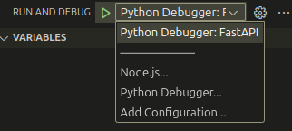

# AI model

To run the model use vscode and run from there:

Install requirements from `requirements.txt`.

# Godot

Use Godot c# v4.3 or later.

Build and run project. Make sure to run project after running AI model.